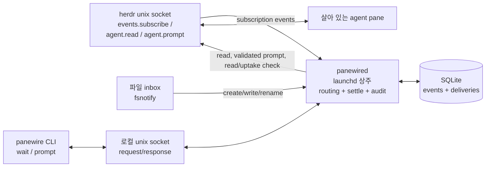

# panewire R0 설계

상태: 설계 전용 · 구현 금지 · 2026-08-28

## 목차

1. [결정 요약과 정본](#결정-요약과-정본)
2. [문제와 근거](#문제와-근거)
3. [범위와 비목표](#범위와-비목표)
4. [실물 herdr 스키마 근거](#실물-herdr-스키마-근거)
5. [아키텍처](#아키텍처)
6. [CLI 계약](#cli-계약)
7. [오배송 방지와 uptake](#오배송-방지와-uptake)
8. [SQLite 스키마 초안](#sqlite-스키마-초안)
9. [스키마 드리프트 가드](#스키마-드리프트-가드)
10. [테스트 전략](#테스트-전략)
11. [배포](#배포)
12. [R1/R2 수용 기준](#r1r2-수용-기준)
13. [향후 작업](#향후-작업)

## 결정 요약과 정본

**정본 불변 원칙:** 파일 inbox와 pane 주입이 계속 정본이다. panewire는 그 주변의 사람 절차인 감시·검증·대기를 코드화할 뿐, 세션 간 통신을 서버 통신으로 바꾸지 않는다.

R0의 정식 산출물은 공개 레포와 이 문서다. 구현은 포함하지 않는다. 이름은 `panewire`, 데몬 바이너리는 `panewired`로 고정한다.

1단계 기능은 `wait`, `prompt`, SQLite 이벤트/전달 로그뿐이다. `notify`, 웹 UI, herdr-remote 대체는 이 단계에 들어오지 않는다.

## 문제와 근거

현재 조율은 다음 세 산문 절차에 의존한다.

| 산문 절차 | 사람이 하던 일 | 요구사항으로의 연결 |
|---|---|---|
| `relay-handoff` §2 대상 검증 | `wrk find`로 이름을 조회하고, 없으면 탭 라벨을 폴백하며, 후보 pane의 cwd와 화면 마지막 줄까지 읽어 직전 작업(KR/US/crypto·역할)이 맞는지 확인 | `prompt`는 이름을 맹신하지 않고 유일한 target을 해석하며, 전송 전 pane read 증거와 revision을 남겨야 한다. 모호하거나 맥락이 맞지 않으면 보내지 않는다. |
| `relay-handoff` §3 주입·제출 검증 | prompt 접수 응답을 전달 증거로 보지 않고, read 화면에서 제출 여부를 확인한다. `[Pasted text #N +M lines]` 칩 또는 컴포저 잔존은 미제출 증거이며, `Press up to edit queued messages`와 칩 없음은 제출 증거다. idle→working 전이는 보조적인 정상 제출 신호다. | `prompt`는 주입 결과와 제출 증거를 별도 상태로 기록하고, 증거가 없으면 성공을 보고하지 않는다. 이미 working이면 상태 전이를 증거로 재사용하지 않는다. |
| `ask-session` §3 파일 대기 계약 | 답변 파일의 출현을 완료의 정본으로 삼고, `agent.wait --status idle`은 보조 신호로만 사용한다. 상태 플랩 때문에 pane 상태만으로 완료를 판정하지 않는다. | `wait --file`은 파일 출현을 정본으로 삼고, `--settle`은 파일이 출현한 뒤 내용/mtime이 안정된 시간을 검증한다. `wait --agent`는 상태 전이를 이벤트로 받되 settle 동안 안정된 상태를 요구한다. |

이 절차가 있음에도 실사고가 오배송 2회와 주입 유실로 이어졌다. 원인은 명령을 실행했다는 사실, 화면의 `❯` 표시, 일시적인 idle을 각각 전달·완료 증거로 오인할 수 있고, 셸 폴링이 durable event history를 남기지 않기 때문이다. R0는 이 세 판단 지점을 하나의 로컬 감사 경로로 묶는다.

## 범위와 비목표

### R0에 포함

- 살아 있는 agent/pane를 대상으로 한 `wait`와 `prompt`.
- herdr socket의 subscription event와 inbox 파일 변경 감시.
- 이벤트, 대상 preflight, 주입·제출·uptake 결과의 SQLite 기록.
- herdr schema drift의 경고와 capability별 fail-closed 동작.

### 명시적 비목표

- **스폰은 wrk의 단일 진입점으로 남는다.** scopefuel 게이트, arbiter, landed 검증, worktree 준비는 wrk의 책임이며 panewire는 재현하거나 우회하지 않는다. 훗날 wrk가 panewire 검증 라이브러리를 import하는 것은 가능하지만, 세션 생성 진입점을 둘로 만들지 않는다.
- 머신 간 전송, NATS, 중앙 서버, 계정·권한 서비스는 설계하지 않는다.
- notify, 웹 UI, herdr-remote 대체는 설계 대상이 아니다.
- panewire는 inbox 파일이나 pane transcript를 정본으로 교체하지 않는다.

## 실물 herdr 스키마 근거

2026-08-28에 작업 디렉터리에서 다음 명령을 직접 실행했다.

```text
herdr api schema --json
```

관찰된 스키마의 top-level 값은 `protocol: 20`, `schema_version: 1`이며 JSON Schema draft 2020-12 형식이다. 설계가 사용하는 요청 메서드와 필드는 다음과 같다.

| 용도 | 실물 메서드/정의 | 확인한 계약 |
|---|---|---|
| 상태 감시 | `agent.wait` / `AgentWaitParams` | `target`, 선택적 `timeout_ms`, `until[]`; 상태 enum은 `idle`, `working`, `blocked`, `done`, `unknown` |
| prompt 주입 | `agent.prompt` / `AgentPromptParams` | 필수 `target`, `text`; 선택적 `wait.timeout_ms`, `wait.until[]` |
| 제출·직전 작업 read | `agent.read` 또는 `pane.read` | 필수 target/pane과 `source`; source는 `visible`, `recent`, `recent_unwrapped`, `detection` |
| 키 제출 보조 | `agent.send_keys`, `pane.send_keys` | target/pane과 keys |
| 이벤트 구독 | `events.subscribe` / `EventsSubscribeParams` | 필수 `subscriptions[]` |
| 이벤트 대기 | `events.wait` / `EventsWaitParams` | `match_event`, 선택적 timeout |

구독 filter는 현재 스키마의 `Subscription` closed vocabulary를 그대로 사용한다. 구독 가능한 종류에는 `pane.output_matched`, `pane.agent_status_changed`, `pane.scroll_changed`가 있고, 상태 필터에는 `agent_status`가, output 필터에는 `pane_id`, `source`, `match`(substring 또는 regex), 선택적 `lines`와 `strip_ansi`가 있다. subscription stream의 envelope는 `event`와 `data`이며, 상태 이벤트에는 `pane_id`, `workspace_id`, `agent_status`와 선택적 `agent`, `display_agent`, `title`, `state_labels`가 온다.

herdr 전체 event kind enum에는 `pane_output_changed`, `pane_agent_status_changed`, `pane_exited`, pane 생성·종료·이동 등도 포함된다. panewire는 R0의 wait/prompt에 필요한 subscription 종류만 구독하고, 나머지는 로그에 들어올 때 unknown/unsupported event로 분류한다. 스키마가 제공하지 않는 필터 문법이나 상태를 추측해 확장하지 않는다.

이 문서의 스키마 관찰은 기억이나 선행 분석의 요약이 아니라 위 명령의 실제 응답에 근거한다. 데몬 시작 시 같은 명령을 다시 실행하는 이유는 이 upstream 계약이 CLI 업데이트로 바뀔 수 있기 때문이다.

## 아키텍처



`panewired`는 사용자 launchd agent로 상주한다. 시작할 때 herdr schema drift guard를 수행하고, herdr unix socket에 subscription을 열며, 설정된 inbox root를 fsnotify로 감시한다. fsnotify 이벤트는 파일 출현을 알리는 신호일 뿐이며, 완료 판정은 실제 파일 `stat`/내용 read와 settle 검증으로 한다. macOS kqueue 기반 fsnotify는 비재귀이므로 `jobs/**` 같은 하위 트리는 디렉터리별 등록 또는 FSEvents 계열을 사용해야 한다. 구체적인 구현 방식은 R1에서 확정한다.

`panewire`는 로컬 unix socket으로 데몬에 요청한다. 모든 wait/prompt 결과는 데몬이 SQLite에 먼저 기록하고 CLI에 반환한다. SQLite write가 되지 않으면 성공을 반환하지 않는다.

### 데몬 부재 시 판단

R0에서는 `wait`와 `prompt` 모두 직접 1회성 herdr 폴백을 하지 않고 fail-closed한다. 직접 폴백은 파일/이벤트 정본과 SQLite 감사, 동일 target lock, 중복 prompt 방지를 우회하며, 결국 사람이 하던 불완전한 절차를 다른 명령으로 되살린다. CLI는 exit 4(`daemon_unavailable`)와 socket 경로·launchd 점검 힌트를 출력한다. 파일 자체를 사람이 직접 읽거나 herdr를 직접 조작하는 것은 가능하지만 panewire 성공으로 보고되지 않는다.

## CLI 계약

공통 규칙:

- duration은 Go duration 형식(`500ms`, `2s`, `10m`)으로 받는다.
- `--timeout`은 전체 대기 기한이며 기본값은 없다. 명시하지 않은 무기한 대기는 R0 CLI에서 허용하지 않는다.
- 성공은 exit 0이다. usage 2, timeout 3, daemon unavailable 4, condition/target invalid 5, delivery/uptake failure 6, internal/persistence failure 70을 사용한다.
- JSON 출력은 R1 구현 시 `--json`으로 제공하되, R0의 필수 표면은 아래 인자와 exit code다.

### `panewire wait`

```text
panewire wait --file PATH --settle DURATION --timeout DURATION
panewire wait --agent TARGET --status STATUS --settle DURATION --timeout DURATION
```

`--file`과 `--agent`는 상호 배타적이다.

| 인자 | 계약 |
|---|---|
| `--file PATH` | 파일이 존재하고 읽을 수 있는지 확인한다. 먼저 size/mtime이 `--settle` 동안 안정된 것을 확인하고, 성공 직전에 SHA-256을 한 번 계산한다. 파일 내용은 SQLite에 복사하지 않는다. |
| `--agent TARGET` | herdr target을 유일하게 해석하고 해당 pane의 상태 이벤트를 기다린다. 이름 우선, pane/tab label은 유일할 때만 폴백한다. |
| `--status STATUS` | agent wait에서 필수. herdr enum의 다섯 값만 허용한다. 파일 wait에서는 사용하면 usage error다. |
| `--settle DURATION` | `0` 이상. 파일은 content/stat 안정, agent는 원하는 상태가 연속 유지된 시간을 뜻한다. 상태가 다른 값으로 바뀌면 settle clock을 초기화한다. |
| `--timeout DURATION` | 전체 기한. 만료 시 exit 3이며 마지막 관찰값과 로그 ID를 출력한다. |

파일 wait는 `ask-session` 계약처럼 파일 출현을 완료의 권위로 사용한다. settle은 불필요한 “아직 쓰는 중” 판정을 줄이는 추가 안정화이며, agent 상태는 절대 파일 출현을 대신하지 않는다. 상태 플랩은 이벤트와 clock reset으로 흡수한다.

agent wait는 subscription을 기다리기 전에 현재 상태를 1회 snapshot/read한다. 이미 원하는 상태라면 그 snapshot 시각부터 settle clock을 시작하고, 이후 다른 상태 event가 오면 clock을 초기화한다. 따라서 이미 `working`인 pane에서 영영 idle→working 전이를 기다리는 교착이 없다. 데몬이 wait 중 재시작되어 연결이 끊기면 CLI는 exit 4로 종료하며, 완료로 가장하거나 조용히 재개하지 않는다. 호출자는 새 wait를 명시적으로 재시도한다.

실패 모드: 잘못된 조합/상태/경로는 2 또는 5, 데몬 미기동은 4, timeout은 3, SQLite commit 실패는 70이다. `blocked`, `done`, `unknown`도 herdr가 실제로 관측한 값이면 정상적인 조건 값이며, 의미를 임의로 idle로 치환하지 않는다.

### `panewire prompt`

```text
panewire prompt --from SENDER --to TARGET --file PATH [--uptake tool|status-transition]
```

| 인자 | 계약 |
|---|---|
| `--from SENDER` | 비어 있지 않은 provenance. 권고 형식은 `세션이름 (역할, pane_id)`이며, 모델명만으로 식별하지 않는다. 원문 prompt와 함께 로그에 남긴다. |
| `--to TARGET` | agent 이름 우선, 없을 때 유일한 탭 라벨 폴백. 복수 후보, 부재, 현재 pane과 문맥 불일치는 전송하지 않는다. |
| `--file PATH` | prompt 본문을 읽을 입력 파일. 파일은 전송의 원문 정본이며 SHA-256을 계산한다. 첫 metadata block에 수신자 identity를 기술하는 `expect:`를 포함해야 한다. |
| `--uptake` | `status-transition` 또는 `tool`. 생략 시 제출 검증까지만 수행하며 uptake 성공을 주장하지 않는다. |

`expect:`는 사람의 §2 화면 판정을 기계적으로 감사 가능하게 만드는 최소 envelope다. 이것은 **새 임무의 token이 아니라 수신자의 현재 identity**를 기술한다. 새 임무 ID는 아직 수신자 pane의 title/read에 없으므로 매칭 대상이 아니다. 예시는 다음과 같다.

```text
expect: name=orch-mock cwd=auto_trader

여기부터 실제 prompt 본문
```

`expect:`에는 검사 가능한 `name=`, `label=`, `cwd=`, `title~=`, `recent~=` 키를 쓸 수 있고, `name=` 또는 `cwd=` 중 하나 이상의 강한 키가 필수다. 데몬은 수신 pane의 title, state labels, cwd/작업 경로, 최근 read와 필드별로 대조하고, identity 일치 증거가 없으면 send 이전에 exit 5로 중단한다. 임무 ID나 새 prompt 내용은 매칭 대상이 아니다. 의미론적 자연어 이해로 “맞겠지”를 판정하지 않는다. expect 값은 짧고 재현 가능해야 하며, 일치 결과와 불일치 이유를 delivery log에 남긴다.

실패 모드: prompt 파일 부재/읽기 실패, provenance 누락, metadata 누락, target 모호성, 수신자 identity 불일치, herdr schema capability 불능은 exit 5 또는 4다. `agent.prompt` 정상 응답만 받고 성공으로 끝내지 않으며, 제출 또는 요청한 uptake 증거가 없으면 exit 6이다. 본문은 기본적으로 DB에 저장하지 않고 hash와 경로만 기록한다.

## 오배송 방지와 uptake

### 전송 전 대상 검증

`relay-handoff` §2를 다음 증거 체인으로 코드화한다.

1. target을 agent 이름으로 resolve하고, 이름이 없을 때만 탭 라벨을 조회한다. 후보가 하나가 아니면 자동 선택하지 않는다.
2. resolve 직후 고정된 `pane_id`, `workspace_id`, tab id, cwd, agent/name, terminal title, revision을 캡처한다. 전송 시점에 pane이 소멸하거나 pane_id, agent/name, cwd가 바뀌면 identity-changed target으로 거부한다. 출력 한 줄 때문에 생긴 revision drift는 거부하지 않고 preflight/send revision을 모두 기록한다.
3. `agent.read`의 `recent_unwrapped`를 우선 사용해 직전 작업과 마지막 줄을 캡처한다. 빈 응답이면 절차대로 `visible`을 재시도한다. ANSI와 컴포저 상태도 판정에 보존한다.
4. 파일의 `expect:` identity field를 pane metadata/read에 대조한다. 후보 pane이 기대한 수신자 name/cwd/label/title/recent identity와 맞지 않으면 주입하지 않는다. 새로 보낼 임무의 ID가 아직 화면에 없다는 이유로 실패시키지는 않는다.
5. preflight의 revision, read digest, target resolution을 SQLite에 commit한 뒤에만 prompt를 제출한다.

이렇게 하면 자동화가 “직전 작업의 의미”를 완전히 이해하지 못하더라도 어떤 pane을 어떤 revision에서 읽고 왜 통과/거부했는지가 재현된다. read 증거가 없거나 애매하면 안전한 답은 오배송 방지용 거부다.

### 주입·제출·uptake 판정

주입 후에는 세 상태를 분리한다: `accepted_by_herdr`, `submitted_to_composer`, `uptake_confirmed`. 첫 상태는 transport 응답일 뿐 마지막 두 상태의 증거가 아니다.

- 대상 pane을 다시 read한다. 짧은 recent가 비어 있으면 `visible`을 사용하고, 전사 회수가 필요하면 `recent_unwrapped`를 사용한다.
- 제출 evidence의 1순위는 주입한 prompt 원문의 marker가 post-injection read/전사에서 관찰되는 것이다. marker는 선두 N자 또는 prompt digest에 대응하는 deterministic snippet으로 매칭하고, 기본 로그에는 원문 대신 marker 종류와 매칭 line digest만 저장한다. scrollback 어디에도 marker가 없으면 빈 컴포저·칩 없음이어도 `unproven`이다. 이는 cold-start에서 주입이 무흔적으로 삼켜진 ROB-1321 사고를 직접 검출한다.
- `❯ 뒤 텍스트`만으로는 제출을 판정하지 않는다.
- `[Pasted text #N +M lines]` 칩이 남아 있거나 방금 원문이 컴포저에 그대로 남아 있으면 **미제출**이다. 이때 자동으로 return을 반복하지 않는다. 사람이 pane을 확인해야 한다.
- `Press up to edit queued messages`가 있고 paste chip이 없으면 절차상 **제출됨/큐 대기** 증거다.
- 평시에는 idle→working 상태 전이를 제출/착수의 보조 증거로 기록한다. 대상이 이미 working이면 전이가 없으므로 증거로 취급하지 않는다. 이미 working인 대상을 추측으로 재주입하지 않고 `uptake_unproven`으로 종료한다.
- interactive pane에 사용자의 타이핑, 텍스트, slash picker가 보이면 주입을 보류하고 exit 6으로 기록한다.

`--uptake`의 의미는 새 프로토콜을 발명하지 않고 현행 절차를 그대로 이름 붙인 것이다.

제출과 tool uptake 매처는 harness kind별로 닫힌 표를 사용한다. Claude 전용 문자열을 Codex·kimi·agy에 일반화하지 않으며, kind를 모르면 보수적으로 `unproven`이다.

| harness kind | 제출 positive matcher | tool-uptake matcher | negative/주의 | R2 fixture |
|---|---|---|---|---|
| Claude | prompt marker; 또는 paste chip이 사라진 `Press up to edit queued messages` | 주입 후 같은 pane의 접수 확인 tool-call 표식 + marker/revision | paste chip 잔존·컴포저 원문 잔존은 미제출; `❯` 단독 금지 | 필수 |
| Codex | prompt marker; 또는 주입 후 해당 prompt 처리와 연결된 `• Ran` tool line | post-injection `• Ran` 접수 확인 tool-call 표식 + marker/revision | 빈 `›`는 증거 아님; 일반 `• Ran`만으로 접수 확인을 주장하지 않음 | 필수 |
| kimi | R2에서 positive screen matcher를 정의하지 않음 | 정의하지 않음 | 일반 텍스트는 `unproven` | 보수적 실패만 |
| agy | R2에서 positive screen matcher를 정의하지 않음 | 정의하지 않음 | 일반 텍스트는 `unproven` | 보수적 실패만 |

표의 marker와 tool line은 주입 이후 revision 범위에 있어야 하며, timestamp만으로 과거 화면을 증거로 재사용하지 않는다.

| mode | 착수 확인으로 인정하는 유일한 조건 | 인정하지 않는 것 |
|---|---|---|
| `status-transition` | 주입 직전 snapshot이 `idle`이고, 같은 pane의 주입 이후 herdr `pane.agent_status_changed`가 `working`으로 바뀐 것. 두 revision/시각을 모두 기록한다. | 이미 working인 상태, 단독 `idle`/`done` read, 정상 prompt 응답 |
| `tool` | 주입 이후 같은 pane의 read/전사에서 수신측의 **접수 확인 도구 호출 흔적**을 확인하고, 호출 line과 revision을 증거로 저장한 것. 도구 호출 흔적이 없으면 실패다. | 일반 텍스트, `❯` 표시, prompt transport 접수증, 상태가 우연히 바뀐 것 |

`tool`은 임의의 “잘 읽었을 것” 추론이 아니라 현재 relay-handoff §3가 요구하는 수신측 접수 확인 도구 흔적을 뜻한다. 특정 도구 이름을 panewire가 만들어 내지 않으며, 구현 시 herdr transcript가 제공하는 호출 표식을 fixture로 고정한다. 어느 mode든 증거가 없으면 exit 6이고, 중복 주입은 자동 복구가 아니다.

## SQLite 스키마 초안

DB 위치는 `~/Library/Application Support/panewire/panewire.sqlite3`를 기본으로 하고 설정으로 바꿀 수 있다. WAL mode와 foreign key를 사용하며, 모든 시간은 UTC Unix milliseconds와 사람이 읽는 ISO 값을 둘 다 가질 필요 없이 하나의 정수 필드로 통일한다.

### `events`

| column | type | 설명 |
|---|---|---|
| `id` | INTEGER PK | 로컬 monotonic event id |
| `observed_at_ms` | INTEGER NOT NULL | 데몬이 관찰한 시각 |
| `source` | TEXT NOT NULL | `herdr` 또는 `inbox` |
| `event_kind` | TEXT NOT NULL | herdr event/subscription kind 또는 `inbox.file_created`, `inbox.file_changed` |
| `protocol` | INTEGER | herdr protocol, inbox에서는 NULL |
| `schema_version` | INTEGER | herdr schema version, inbox에서는 NULL |
| `pane_id` / `workspace_id` | TEXT | 관련 식별자 |
| `agent` / `agent_status` | TEXT | 이벤트에 있으면 기록 |
| `revision` | INTEGER | herdr pane revision |
| `path` | TEXT | inbox 경로(본문 아님) |
| `payload_json` | TEXT NOT NULL | 원본 event envelope의 allowlisted metadata |
| `unknown_fields_json` | TEXT | 드리프트 경고 대상 필드/값의 metadata |

`payload_json`은 payload가 커지지 않도록 schema-known metadata와 digest만 저장한다. pane transcript나 prompt 본문을 이벤트 테이블에 넣지 않는다.

### `deliveries`

| column | type | 설명 |
|---|---|---|
| `delivery_id` | TEXT PK | 요청 correlation id |
| `requested_at_ms` / `completed_at_ms` | INTEGER | 시작/종료 시각 |
| `sender` | TEXT NOT NULL | `--from` provenance |
| `target_input` | TEXT NOT NULL | 사용자가 준 `--to` |
| `resolved_pane_id` / `resolved_workspace_id` | TEXT | 실제 대상 |
| `source_path` | TEXT NOT NULL | prompt 파일 경로 |
| `prompt_sha256` | TEXT NOT NULL | 본문 자체 대신 재현용 digest |
| `body_stored` | INTEGER NOT NULL DEFAULT 0 | 명시적 opt-in 여부 |
| `preflight_revision` | INTEGER | 직전 read revision |
| `send_revision` | INTEGER | prompt 제출 직전 revision; 출력 drift 기록용 |
| `preflight_read_sha256` | TEXT | screen evidence digest |
| `preflight_result` | TEXT NOT NULL | `passed`, `ambiguous`, `mismatch`, `identity_changed` |
| `herdr_acceptance` | TEXT | `accepted`, `rejected`, `unknown` |
| `submission_result` | TEXT | `marker_observed`, `submitted`, `queued`, `composer_residue`, `unproven` |
| `uptake_mode` | TEXT | `tool`, `status-transition`, NULL |
| `uptake_result` | TEXT | `confirmed`, `unproven`, `not_requested` |
| `evidence_revision` | INTEGER | 제출/uptake evidence revision |
| `error_code` | TEXT | exit code와 대응하는 stable code |

필요한 index는 `(resolved_pane_id, requested_at_ms)`, `(source_path, requested_at_ms)`, `(event_kind, observed_at_ms)`다. `deliveries`의 source path와 digest로 prompt 파일 정본과 연결하며, DB가 본문을 대신하지 않게 한다.

### prompt 본문 저장 판단

기본은 **메타데이터만**이다: sender, target, file path, SHA-256, preflight/submission/uptake evidence와 오류를 저장하고 prompt 본문은 저장하지 않는다. prompt에는 회사 비밀·토큰·고객 데이터가 포함될 수 있고, hash도 민감한 짧은 본문에는 추측 공격 단서가 될 수 있으므로 접근 권한을 제한한다.

명시적인 로컬 설정 opt-in(`logging.store_prompt_body = true`)이 있을 때만 별도 `delivery_bodies` 테이블에 본문을 저장할 수 있게 권고한다. 이 모드는 기본 off, 문서화된 보존 기간과 파일 권한을 요구하며 R0에서는 암호화·중앙 수집을 약속하지 않는다. 따라서 R1 구현의 기본 테스트는 DB에 본문 substring이 없음을 실패 전 상태로 검증한다.

## 스키마 드리프트 가드

데몬 시작 순서는 다음과 같다.

1. `herdr api schema --json`을 실제 실행하고 protocol/schema_version, 사용 메서드, 사용 request field, subscription kind/filter, status/read-source enum의 현재 응답을 읽는다.
2. panewire가 의존하는 최소 계약과 대조한다. 현재 기준은 `events.subscribe`, `agent.wait`, `agent.read`/`pane.read`, `agent.prompt`, `pane.send_keys`와 위 표의 enum이다. 비교 결과를 startup event와 stderr에 출력한다.
3. 알려지지 않은 event kind, subscription data field, response field는 `warning`으로 기록하고 처리를 계속한다. unknown field는 payload에 보존하되 allowlist 밖의 의미를 추론하지 않는다. 이는 차단하지 않는다.
4. 반대로 필수 메서드가 없어졌거나 필수 field의 타입/enum이 호환되지 않으면 해당 capability를 `unavailable`로 표시한다. 데몬 프로세스 자체는 살아 있어 inbox-only wait를 계속할 수 있지만, agent wait/prompt는 exit 4로 fail-closed하며 send를 시도하지 않는다.
5. schema command 자체가 실패하면 마지막 schema를 조용히 캐시 폴백하지 않는다. startup 경고와 herdr capability unavailable을 기록한다. 운영자는 upstream CLI를 확인한 뒤 재시작한다.

herdr socket이 끊겼다가 재연결될 때도 subscription을 다시 열기 전에 1~5단계의 schema guard를 재실행한다. 재연결 generation과 guard 결과를 `events`에 남기며, 재연결 시점의 필수 계약이 불능이면 해당 capability를 즉시 unavailable로 둔다.

스키마 snapshot을 레포에 복사해 정본으로 삼지 않는 이유는 upstream 실물 응답과의 대조가 목적이기 때문이다. fixture에는 정상 snapshot, unknown event/field, missing required method/field, enum drift를 각각 둔다. unknown은 warning-only, required incompatibility는 capability fail-closed라는 판정이 테스트로 고정된다.

## 테스트 전략

### 가짜 herdr socket fixture

wrk 테스트 하네스의 전례처럼 Unix socket fixture를 사용한다. fixture는 schema 응답과 JSON request/response, subscription event timing을 결정적으로 재생한다. 실제 herdr를 실행하지 않아도 다음을 검증한다.

- unique name, missing name→unique label fallback, ambiguous label, pane id 변경.
- preflight read의 `recent_unwrapped`와 빈 read→`visible` fallback.
- idle→working, working 유지, idle/working flap, timeout과 settle clock reset.
- prompt 정상 응답 뒤 composer chip 잔존, queued-message 표시, tool-call line, no evidence.
- herdr socket disconnect, SQLite commit failure, daemon absent.
- unknown schema event/field는 warning으로 남고, required schema incompatibility는 send 전에 차단.

### 파일 fixture

임시 inbox root에서 create→partial write→final write→rename 순서를 재생한다. 파일 출현만으로 즉시 성공하면 테스트가 실패하고, settle 동안 digest/size/mtime이 안정된 뒤에만 성공해야 한다. 파일 내용은 DB에 들어가지 않는지 확인한다.

### 실 herdr smoke

fixture 테스트와 분리된 선택적 smoke job에서 실제 `herdr api schema --json`, events subscription, agent read/wait를 실행한다. live pane에 prompt를 보내는 smoke는 기본 금지하며, 별도의 운영자 승인과 전용 fixture pane이 있을 때만 수행한다. 실제 smoke가 실패해도 fixture의 계약 판정을 완화하지 않는다.

## 배포

구현 시 하나의 Go module과 단일 바이너리 산출물을 목표로 한다. CLI와 데몬 진입점은 같은 바이너리의 subcommand 또는 두 이름(`panewire`, `panewired`)으로 제공하되, R0에서는 어느 코드도 만들지 않는다.

```text
go install github.com/mgh3326/panewire/cmd/panewire@latest
go install github.com/mgh3326/panewire/cmd/panewired@latest
```

회사 MacBook 설치 경로는 관리되는 Go toolchain으로 `go install`을 실행하고, per-user `~/Library/LaunchAgents/dev.panewire.panewired.plist`를 설치해 로그인 시 데몬을 시작하는 방식이다. plist는 DB·socket·inbox root를 명시하고 stdout/stderr 로그 경로와 재시작 정책을 가져야 한다. herdr가 없는 노트북에서는 데몬을 실행해도 agent capability가 unavailable이며 prompt를 성공 처리하지 않는다.

## R1/R2 수용 기준

각 기준은 구현 전에는 실패하고, 구현 후에는 fixture로 재현 가능한 형태로 쓴다.

### R1 — scaffold + events + wait

- **R1-1 schema guard:** 정상 fixture에서 startup·reconnect 검증 결과가 기록된다. unknown event/field fixture에서는 warning만 남고 데몬과 inbox wait가 살아 있다. 필수 method/field 제거 fixture에서는 agent wait/prompt capability가 unavailable이고 send는 0회다.
- **R1-2 event log:** status/output/scroll subscription과 inbox create/change가 각각 `events`에 source, kind, pane/path, revision, payload metadata로 남고, 재시작 후 기존 row가 사라지지 않는다.
- **R1-3 file wait:** 존재하지 않는 파일은 timeout 3이다. partial write fixture는 settle 전 성공하지 않으며, size/mtime 안정화 후 SHA-256을 한 번 계산해 exit 0이다. 파일 본문 substring이 DB에 없어야 한다.
- **R1-4 agent wait:** 시작 시 현재 상태 snapshot이 목표 상태면 그 시점부터 settle을 시작한다. 목표 상태가 settle 동안 유지될 때만 exit 0이고, 상태 flap은 settle을 재시작하며, 기한이 지나면 exit 3이다. `idle`, `working`, `blocked`, `done`, `unknown`을 임의 변환하지 않는다. 데몬 재시작으로 연결이 끊기면 exit 4다.
- **R1-5 no daemon fallback:** socket을 닫은 상태에서 두 CLI 모두 exit 4이고 herdr에 직접 요청하지 않는다.

### R2 — prompt verification + uptake

- **R2-1 target safety:** ambiguous/missing target, pane 소멸 또는 pane_id/agent/name/cwd identity change, `expect:` mismatch는 prompt request 전에 exit 5이며 `agent.prompt` 호출 수가 0이다. 일반 출력으로 인한 revision drift만 있는 fixture는 거부하지 않고 두 revision을 기록한다.
- **R2-2 preflight evidence:** 성공 delivery row에는 resolved pane/workspace, preflight revision, send revision, read digest, `expect:` identity 판정이 있고, `❯`만 있는 fixture는 통과하지 않는다.
- **R2-3 submission evidence:** 정상 transport 응답만 있는 fixture는 exit 6이다. prompt marker, harness별 positive matcher, queued-message/no-chip 또는 idle→working fixture만 현행 절차가 허용하는 제출 evidence로 분류된다. composer chip/text residue는 미제출이며, **완전 삼킴 fixture(빈 컴포저·칩 없음·scrollback marker 없음)**도 exit 6이다.
- **R2-4 uptake semantics:** `status-transition`은 pre-idle→post-working 전이가 없으면 실패한다. pre-working 상태 fixture는 재주입하지 않는다. `tool`은 post-injection receipt tool-call line과 revision이 없으면 실패하고, 일반 텍스트는 성공으로 세지 않는다.
- **R2-5 privacy:** 기본 설정의 `deliveries`에는 prompt 본문이 없고 SHA-256/path/metadata만 있다. explicit body opt-in fixture에서만 별도 body row가 생긴다.
- **R2-6 auditability:** 성공·거부·timeout·daemon unavailable 모두 stable error/result와 correlation id를 남기며, 동일 request 재시도 정책이 중복 주입을 만들지 않는다.

## 향후 작업

R0의 2주 실사용과 회사 데이터 방향 규정 확인 뒤 별도 승인으로 notify, 웹 UI, herdr-remote 대체를 검토한다. 머신 간 NATS 전송은 설계하지 않으며, 전송층이 뒤에 붙을 수 있게 정본은 파일로 유지한다.
